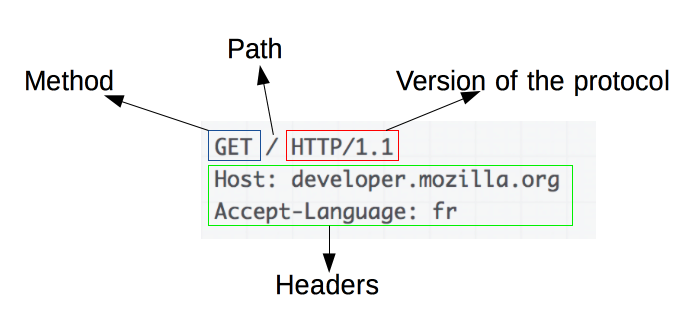

# 웹 애플리케이션 서버

## 진행 방법

* 웹 애플리케이션 서버 요구사항을 파악한다.
* 요구사항에 대한 구현을 완료한 후 자신의 github 아이디에 해당하는 브랜치에 Pull Request(이하 PR)를 통해 코드 리뷰 요청을 한다.
* 코드 리뷰 피드백에 대한 개선 작업을 하고 다시 PUSH한다.
* 모든 피드백을 완료하면 다음 단계를 도전하고 앞의 과정을 반복한다.

## 온라인 코드 리뷰 과정

* [텍스트와 이미지로 살펴보는 온라인 코드 리뷰 과정](https://github.com/next-step/nextstep-docs/tree/master/codereview)

## 구현할 기능 목록

### Step 1

* [x] 모든 Request Header를 출력할 수 있다.
  * [x] 메서드(`CustomMethod`)를 추출할 수 있다.
    * 메서드는 GET과 POST가 존재한다.
  * [x] path(`CustomPath`)를 추출할 수 있다.
  * [x] headers(`CustomHeaders`)를 추출할 수 있다.

* [x] Request Line에서 path 분리할 수 있다.

* [x] path에 해당하는 파일 읽어 응답할 수 있다.

* [x] CSS 및 JS를 지원할 수 있다.

* [x] QueryString을 파싱할 수 있다.
 
* [x] POST 요청을 처리할 수 있다.
  * [x] Request Body값을 추출할 수 있다.

* [x] 회원가입 후 Redirect 응답을 보낼 수 있다.

### Step 2

* [x] 로그인 기능 구현
  * [x] 로그인 성공/실패 여부를 판별하고 응답할 수 있다.
  * [x] 회원가입한 사용자로 로그인할 수 있어야 한다.
  * [x] 로그인 성공 시 쿠키를 생성하고 응답할 수 있다.
  * [x] Cookie 클래스를 추가하고 Request Header에 JSESSIONID가 없으면 Response Header에 반환해준다.
* [x] 템플릿 엔진 활용하기
    * [x] 로그인 상태에서 /user/list 접근 시 사용자 목록을 출력한다.
    * [x] 비로그인 상태서는 로그인 페이지로 이동한다.
* [ ] Session 구현하기
  * [x] 쿠키 값으로 로그인 여부를 체크할 수 있다.
  * [ ] 로그인에 성공하면 Session 객체의 값으로 User 객체를 저장한다.
  * [ ] 로그인 상태 시 로그인 페이지에 접근할 경우 /index.html로 리다이렉트한다.
  * [x] 세션 정보 저장을 위한 SessionManager 클래스를 추가한다.
  * [x] 클라이언트별 세션 데이터를 관리하는 세션 클래스를 추가한다.
